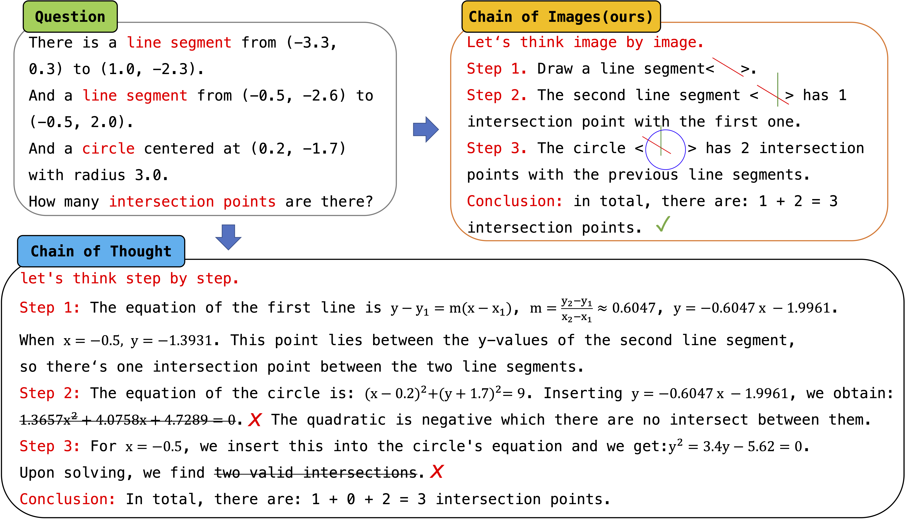

# CoI: Chain of Images for Intuitively Reasoning
This repository is the official implementation of "[Chain of Images for Intuitively Reasoning](Chain_of_Images.pdf)". Welcome to discuss this paper with me on [知乎](https://www.zhihu.com/people/meng-fan-xu-4/posts).
Comparing to CoT which utlize language as an intermedia for solving complex task, Chain of Images (CoI) convert complex language reasoning problems to simple pattern recognition by generating a series of images as intermediate representations.

# Demo
Welcom to try the demo of CoI running on [huggingface space](https://huggingface.co/spaces/fxmeng/Chain-of-Image).

# Todo list
- [ ] Release the CoIEval datasest
- [ ] Release the checkpoint of SyMLLM framework
- [ ] Build CoI Benchmark
